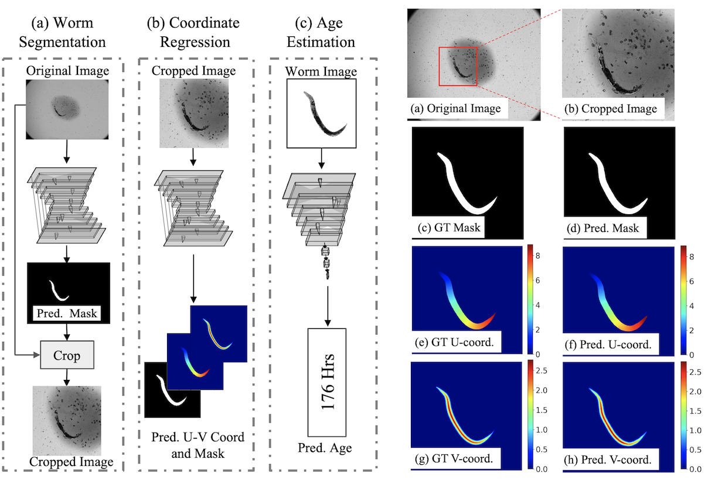

## Celeganser: Automated Analysis of Nematode Morphology and Age
**Authors**: [Linfeng Wang](https://derrickwanglf.github.io), [Shu Kong](http://www.cs.cmu.edu/~shuk/), [Zachary Pincus](https://developmentalbiology.wustl.edu/people/zachary-pincus/), [Charless Fowlkes](https://www.ics.uci.edu/~fowlkes/)

[Accepted](https://cvmi2020.github.io/accepted.html)  by [ CVMI 2020](https://cvmi2020.github.io/index.html) (**Last edited**: May 17, 2020)

**Link**: [Full Paper](https://arxiv.org/abs/2005.04884) [Slides](https://docs.google.com/presentation/d/1lciS29gSs9eLH0w4hWQXu1al_SYfMjxj0o9erMjkwi8/edit?usp=sharing)

## Abstract
The nematode Caenorhabditis elegans (C. elegans) serves as an important model organism in a wide variety of biological studies. In this paper we introduce a pipeline for automated analysis of C. elegans imagery for the purpose of studying life-span, health-span and the underlying genetic determinants of aging. Our system detects and segments the worm, and predicts body coordinates at each pixel location inside the worm. These coordinates provide dense correspondence across individual animals to allow for meaningful comparative analysis. We show that a model pre-trained to perform body-coordinate regression extracts rich features that can be used to predict the age of individual worms with high accuracy. This lays the ground for future research in quantifying the relation between organs’ physiologic and biochemical state, and individual life/health-span.

## Figures and Results

For a given cropped image (a), we train for re- gressing towards its worm UV-coordinate on the body pix- els, as shown by (b) and (c) respectively. Based on the pre- dicted coordinates, we can straighten the worm according to a defined “canonical” shape, as shown in (d). This helps us analyze worm age and thus the life/health-span in later work.

We visualize the body UV-coordinate regression output. With the ground-truth and predicted UV-coordinates, we straighten the worm into “canonical shape”, respectively. Visually we can see the straightened worms match quite well between using predicted and ground-truth UV’s.

“Celeganser” includes three models: (a) worm segmentation at coarse scale, (b) worm body coordinate regression and (c) age estimation. Using a downsized in- put image, model (a) predicts a binary segmentation of the worm region. This is used to localize and crop the worm region from the original full-resolution data. The cropped image is then fed to the model (b) for boy coordinate re- gression and fine segmentation. The segmented worm is the input to the third model (c) for age estimation.

Worm body coordinate regression model takes as input the sub-image (b) which is cropped from the original image (a), and outputs worm segmentation mask (d) and UV coordinate predictions (f) and (h), respectively.
